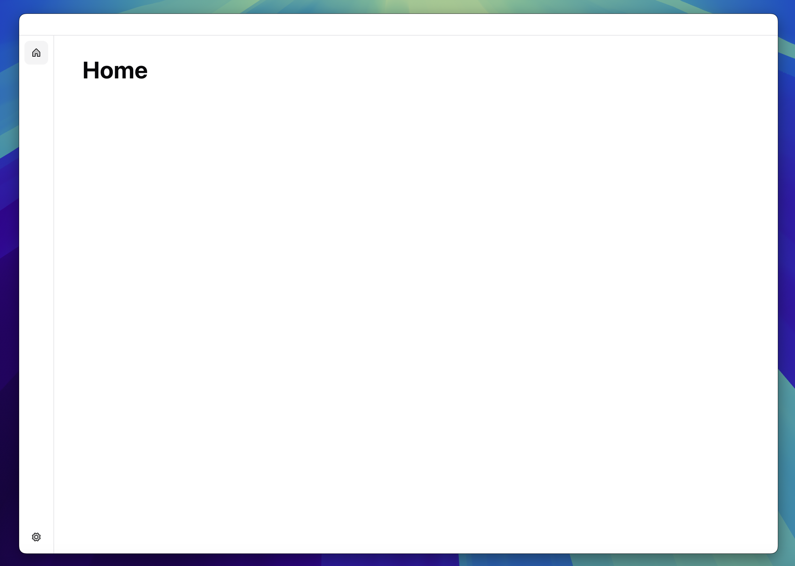
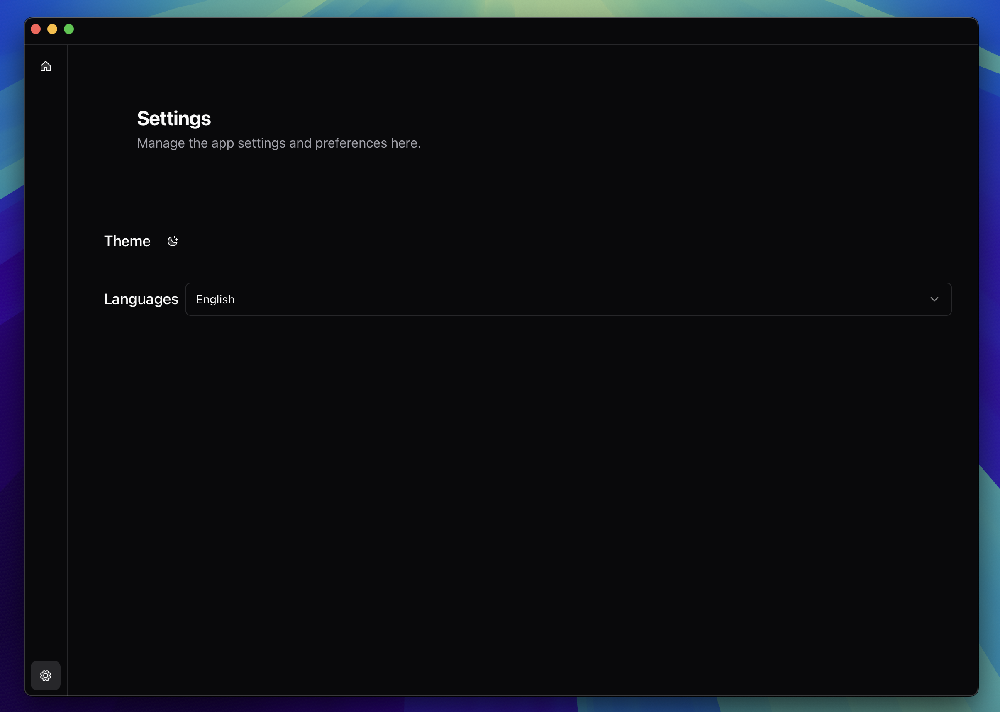
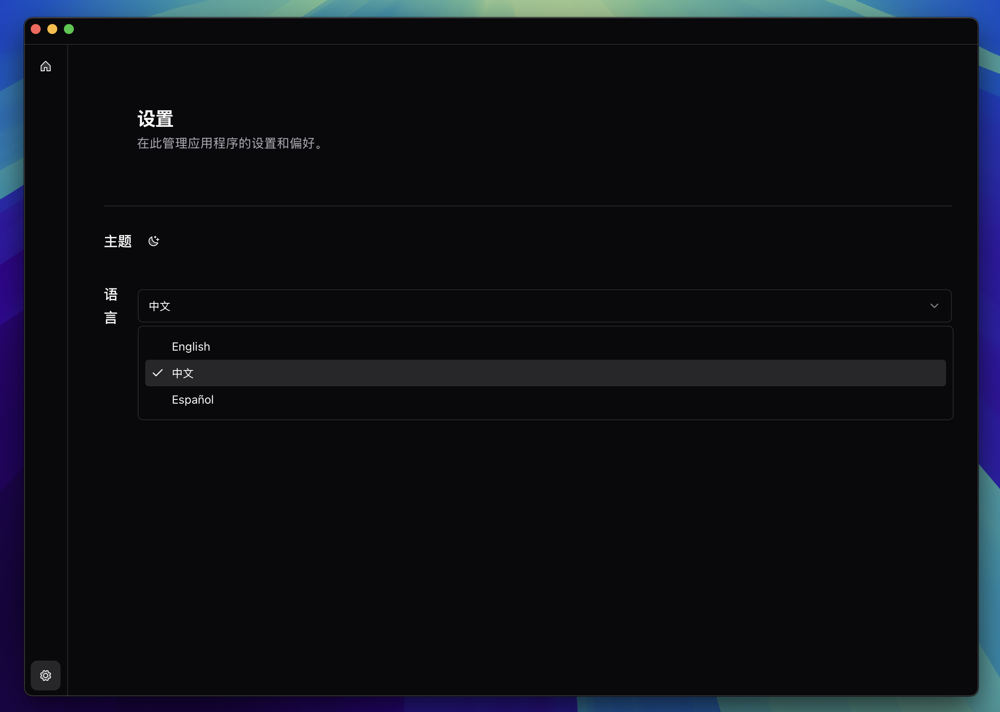

# tauriv2-vue-desktop-starter

A desktop application starter using the libraries and technologies:

- Rust

  - [Tauri v2](https://beta.tauri.app/start/) as the desktop application framework.
  - [Tauri Store Plugin](https://v2.tauri.app/plugin/store/) for persistence.
  - [Tauri Log Plugin](https://v2.tauri.app/plugin/logging/) for logging.
  - [CrabNebula DevTools](https://v2.tauri.app/develop/debug/crabnebula-devtools/) for development.

- Vue.js 3
  - [Shadcn Vue + Tailwind CSS v4](https://www.shadcn-vue.com/) for components.
  - [Vue Router](https://router.vuejs.org/) for application routing.
  - [Vue I18n](https://vue-i18n.intlify.dev/) for internationalization.
  - [Pinia](https://pinia.vuejs.org/introduction.html) for state management.

## Preview

### _Light mode dashboard view_



### _Dark mode settings view_



### _Language support view_



## Recommended IDE Setup

- [VS Code](https://code.visualstudio.com/) + [Volar](https://marketplace.visualstudio.com/items?itemName=Vue.volar) + [Tauri](https://marketplace.visualstudio.com/items?itemName=tauri-apps.tauri-vscode) + [rust-analyzer](https://marketplace.visualstudio.com/items?itemName=rust-lang.rust-analyzer)

## Prerequisites

Follow [Tauri's prerequisites guide](https://v2.tauri.app/start/prerequisites/) to setup your development environment.

Then rename all instances of `tauriv2-vue-desktop-starter` and `tauriv2_vue_desktop_starter` to your app name.

If you want to replace the package manager update:

- The build configuration in [tauri.conf.json](./src-tauri/tauri.conf.json)
- Update the following steps in [.github/workflows/publish-to-auto-release.yml](.github/workflows/publish-to-auto-release.yml):
  - Install pnpm
  - Install Node.js
  - Install frontend dependencies
- Update the following steps in [.github/workflows/test-build-only.yml](.github/workflows/test-build-only.yml):
  - Install pnpm
  - Install Node.js
  - Install frontend dependencies

## Installation

Install dependencies with `pnpm install`

## Development

For **Desktop** development, run: `pnpm tauri dev`

### Internationalization (i18n)

[Vue I18n](https://vue-i18n.intlify.dev/)

#### Adding a new language

Create a new JSON file in the [locales](./src/i18n/locales/) directory with the appropriate translations and the locale as the filename.

Then update the `supportedLanguages` function in [lib/config.ts](./src/lib/config.ts) to include the new language.

### Helpful Tips

Tauri Store Plugin stores `settings.json` at:

**macOS**: `~/Library/Application Support/com.github.tauriv2-vue-desktop-starter`

#### App Icon

Tauri CLI provides an [icon command](https://v2.tauri.app/reference/cli/#icon) `pnpm tauri icon` which takes an image path and generates icon files for your application.

## Contributing

Contributions are welcome! Feel free to:

- Open issues for bugs or feature requests
- Submit pull requests for improvements
- Provide feedback on existing features
- Suggest documentation improvements
- Help with translations

## Deployment & Release

[Tauri v2 Deployment Guide](https://v2.tauri.app/distribute/)

To build a binary, run:

```bash
pnpm tauri build
```

This repo is currently setup to create a release on Github when you merge to the `release` branch. See [https://github.com/tauri-apps/tauri-action/tree/dev](https://github.com/tauri-apps/tauri-action/tree/dev).

### Caveats

If you are using the [signing identity](./src-tauri/tauri.conf.json#L32) `-` for **macOS**, when you first download and run the application, you will have to go to `System Settings` > `Privacy & Security` and allow your app to run.
See [tauri-apps/tauri-action/issues/824](https://github.com/tauri-apps/tauri-action/issues/824) & [support.apple.com/open-a-mac-app-from-an-unidentified-developer](https://support.apple.com/guide/mac-help/open-a-mac-app-from-an-unidentified-developer-mh40616/mac).
